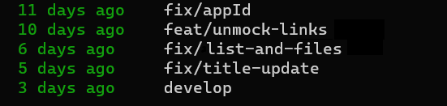

Aliases are shortcuts for your most-used or complex Git commands

## Edit your git config file

If it is located in your home folder and you are using nano, you can do so:

```bash
nano ~/.gitconfig
```

Otherwise, pick the editor of your choice and the right location of the file.

If you don't have this config file already, create it:

```bash
touch ~/.gitconfig
```

## Add the alias

For example let's add a useful shortcut for listing all your current branches with their last update time.

Add the following lines to the config file (if you already have an "[alias]" section, just add the alias):

```vim
[alias]
    wip= for-each-ref --sort='authordate:iso8601' --format=' %(color:green)%(authordate:relative)%09%(color:white)%(refname:short)' refs/heads
```

## How to use it

All you have to do now is typing `git wip` in your terminal.

```bash
git wip
```




## More useful aliases

```
s= status -sb
a= add
c= commit -m
pl= pull
ph= push
d= diff
md= merge --no-ff develop
l= log --all --decorate --oneline --graph
last= log -1 HEAD --stat
conf= config --global -l
```

Now you can commit like a pro : 

```bash
git pl
git s
git a .
git c "<conventional commit message>"
git ph
```
