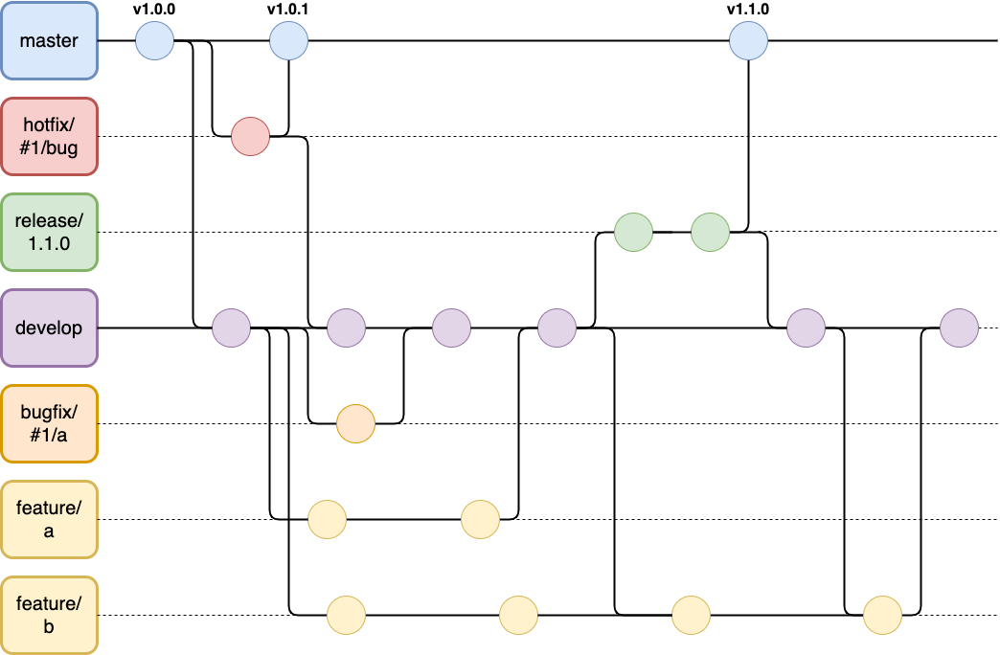

---

---

Gitflow is an alternative Git branching model that involves the use of feature branches and multiple primary branches. Compared to trunk-based development, Giflow has numerous, longer-lived branches and larger commits. 
Under this model, developers create a feature branch and delay merging it to the main trunk branch until the feature is complete. These long-lived feature branches require more collaboration to merge and have a higher risk of deviating from the trunk branch. They can also introduce conflicting updates.

Gitflow can be used for projects that have a scheduled release cycle and for the DevOps best practice of continuous delivery. This workflow doesn’t add any new concepts or commands beyond what’s required for the Feature Branch Workflow. Instead, it assigns very specific roles to different branches and defines how and when they should interact.
In addition to feature branches, it uses individual branches for preparing, maintaining, and recording releases. 
Of course, you also get to leverage all the benefits of the Feature Branch Workflow: pull requests, isolated experiments, and more efficient collaboration.

## Summary

The overall flow is as follow :

- A develop branch is created from master.
- A release branch is created from develop.
- Feature, Doc, Test and Build branches are created from develop.
- When a feature is complete it is merged into the develop branch.
- When the release branch is done it is merged into develop then master on release date.
- If an issue in master is detected a hotfix branch is created from master.
- Once the hotfix is complete it is merged to both develop and master.

