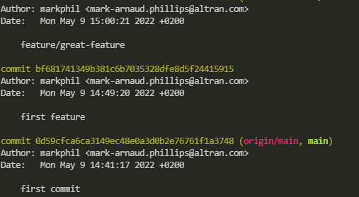
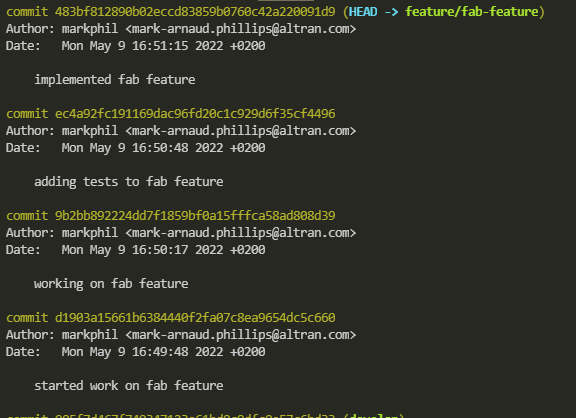
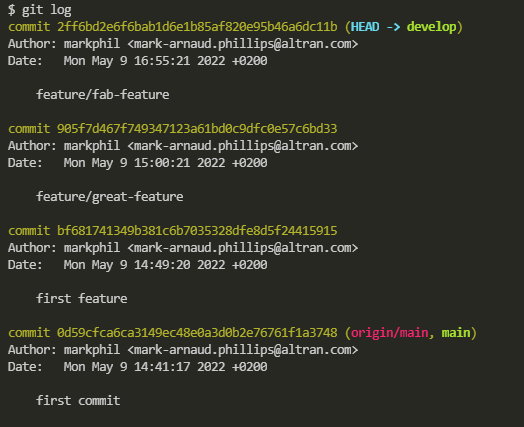

## What is Git Squash

Squashing in Git is the process of merging several commits into one. 

## Why would I want to squash my commits

Often when we are working on a feature / bug fix / refactor etc, we may find ourselves making several interim commits over the duration of the change. Whilst we can push back to our main branch including all of these commits this creates noise in the commit history potentially making it harder to identify the actual commit we are interested in.

## How do I Squash my commits

Git does not have a specific command to squash commits instead we make use of existing git commands.

## git merge <branch> --squash

git merge <branch> --squash allows us to merge one branch into another and condensing the commit history on the branch we are merging. It does this by creating a new commit and adding our changes to this commit, but stops before making the actual commit leaving us to add the clean commit message.

In the example below we have been given the task to create a "great-feature", so the first thing we do is checkout the code and create a new branch:

```
git checkout -b feature/great-feature
```
on checking the log we might see something like this ahead of creating our branch



At some point we will have completed the work on "great-feature" and are ready to merge this back into the main development branch. 

Ahead of doing this we want to get rid of the commit history we made whilst working on the branch so that our main development branch only registers a single commit for our feature and does not include all the interim commits we made whilst developing on the branch.



to do this we first need to checkout the branch we want to merge into, in this case the "develop" branch

```
git checkout develop
```

to merge our changes from the feature/great-feature branch and squash the commit history we use

```
git merge feature/great-feature --squash
```

The should merge our feature branch back into develop and squash our commit history. 

At this stage it is important to note git has not committed this merge for us, we must do this adding a final commit message that we want to remain in out develop branch history. This message should represent the feature we have just worked on:

```
git commit -m"feature/great-feature" 
```

at the end of this process our log might look like this:



Note our feature branch will still retain the git history for that branch until such time as we delete the branch


and our develop branch maintains a clean history.

